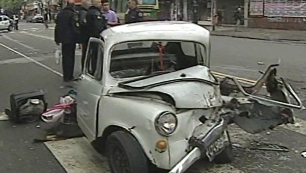

#Accidentes seguros
 

## Ejercicio Integrador

**Es un desastre el tránsito en la ciudad. Los colectiveros se creen dueños de la calle, los taxistas se meten por cualquier lado, los que van en autos particulares están siempre apurados y qué hablar de los motoqueros. Con este panorama, inevitablemente, los accidentes abundan. Mientras desde el Estado y entidades de la sociedad civil se busca prevenir estas situaciones a largo plazo mediante la educación vial, nosotros nos ocupamos de asuntos más inmediatos (y rentables): los seguros.**

Todo vehículo motorizado que circula por las calles de la ciudad debe contar con un seguro básico, que se denomina coloquialmente "contra terceros", pero actualmente hay también pólizas de seguro que incluyen necesariamente la cobertura básica y ofrecen más servicios.

Cuando todo va bien no importa el seguro que tenga el vehículo, pero cuando menos se lo espera, cualquiera puede quedar involucrado en un choque o cualquier tipo de accidente de tránsito. A todas estas eventualidades, en el ambiente se las llama genéricamente siniestros. 
Todas las aseguradoras ofrecen una gama de seguros que consiste en:

- Un seguro contra terceros cubre los daños que el vehículo pudiera ocasionar en otros vehículos y sus pasajeros, peatones o cualquier otra cosa afectada en algún siniestro, excepto el mismo vehículo y quienes van en él. 
- Un seguro "contra todo riesgo" cubre todos los siniestros y abarca tanto al propio vehículo como a los terceros afectados.

El objetivo principal es averiguar, ante un siniestro, cuánto debería pagar la aseguradora de un vehículo, (al margen de la negociación que posteriormente hagan para pagar menos, juicios, etc.).
De los siniestros se conocen la valuación de los daños de cada uno de los vehículos que intervienen (donde se incluye a sus respectivos pasajeros) y también se registran, en caso de haber, otras cosas o personas afectadas y sus respectivas valuaciones de daño también. 
Un vehículo puede tener sólo una póliza, pero puede cambiarla por otra, de la misma u otra empresa de seguros.
En cualquier siniestro, con cualquier cobertura, lo que la aseguradora no cubre, lo paga el vehículo y viceversa.
La superintendencia de seguros lleva el registro de todos los siniestros producidos en la ciudad. 

###Ejemplo:

Se produjo hace un rato un choque en la intersección de Av 25 de Mayo y Av, San Martín, en el que está involucrado un fiat 600 con un seguro contra terceros de la empresa "Soruges", un colectivo de la línea 21 con un seguro contra todo riesgo de la aseguradora "Chano"  y una moto con un seguro contra terceros de "Que Dios se lo pague". En el fitito viajaban dos personas, no hubo que lamentar víctimas fatales, y por el estado en que quedó se estima el daño en $20000. El bondi estaba lleno, pero sólo sufrió rasguños que se calculan en $500. Por su parte, la moto tuvo daños leves de $20 y su conductor no se hizo nada porque llevaba el casco puesto. En el siniestro se dañó un semáforo cuyo arreglo cuesta $1000. Un peatón que cruzaba velozmente la calle porque llegaba tarde a un examen en la facultad se salvó por centímetros de ser embestido y alegó una conmoción emocional cuyo resarcimiento se estima en $2000. 

Por lo tanto, lo que debería pagar cada aseguradora por este siniestro es:
- “Soruges”: $ 3520, al ser una póliza solo contra terceros, no tiene en cuenta el daño que sufre el fitito en sí, sino que debe abonar los daños al semáforo, peatón y el bondi y la moto. (1000 + 2000 + 500 + 20) 
- “Chano”: le corresponde $ 23520, ya que la póliza cubre todos los daños. (también incluye lo del fitito 1000 + 2000 + 500 + 20 + 20000) 
- “Que Dios se lo pague”: es una póliza también contra terceros, pero al ser de la moto, incluye los gastos de todos, excepto la moto, lo que da $23500.

Desde el punto de vista de cada vehículo, lo que paga cada uno es:
- La moto: paga solo sus costos, $20
- El fitito: paga los 20000 del costo de su propio daño.
- El bondi: no paga nada porque el seguro paga todo

Importante: Tener en cuenta que un auto puede tener diferentes siniestros y el costo del daño no tiene porqué ser el mismo siempre.

###Se pide:

- Definir los objetos necesarios.
- Implementar los métodos que permitan:
1. Calcular cuánto debe pagar la aseguradora en un siniestro por un vehículo. (Si el vehiculo no intervino en el siniestro, se debe generar una excepcion)
2. Calcular para un vehículo, lo pagado en concepto de arreglos no cubiertos por su seguro de todos los siniestros que protagonizó. 
3. Hacer algunos tests importantes para los ejemplos señalados. 
